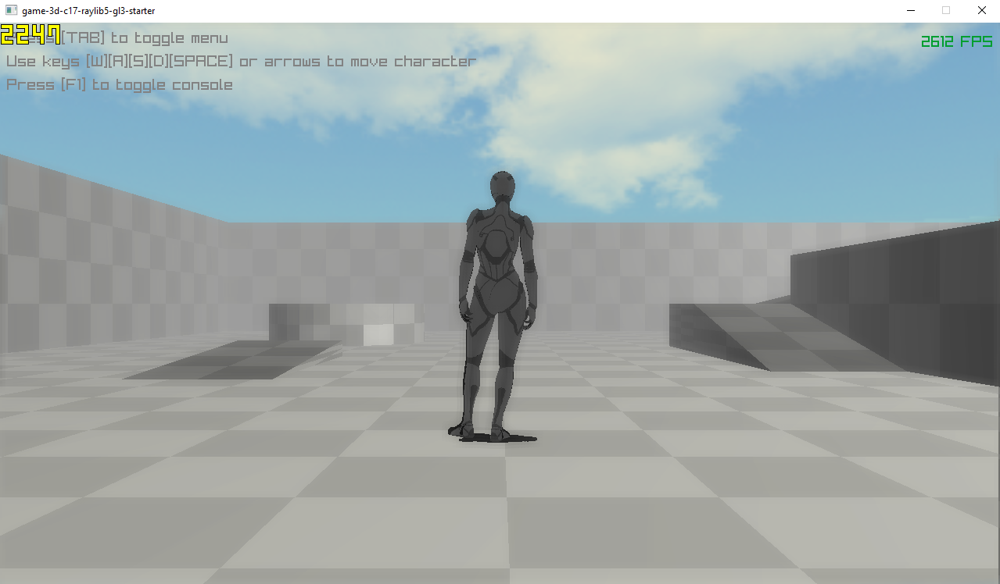
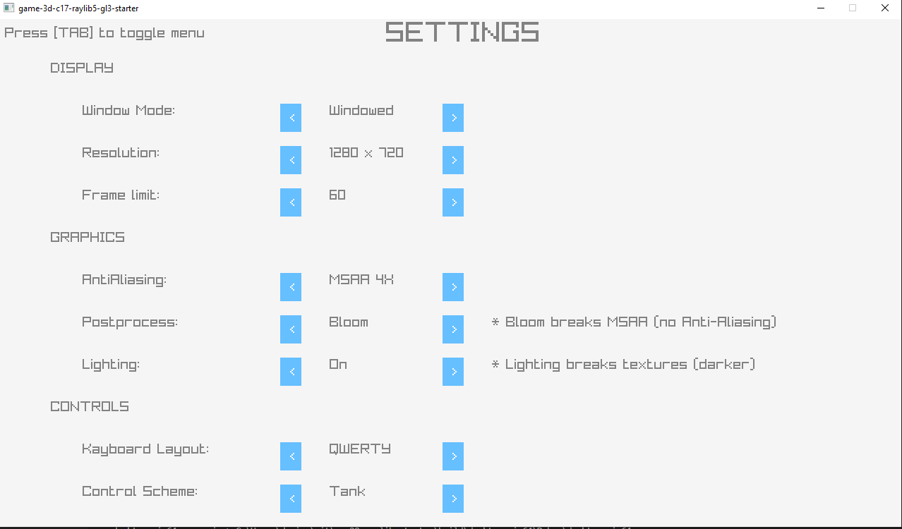
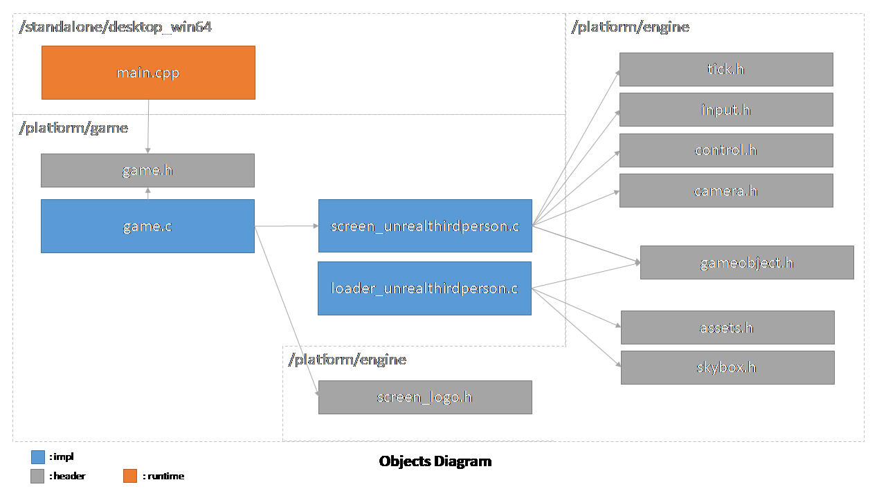
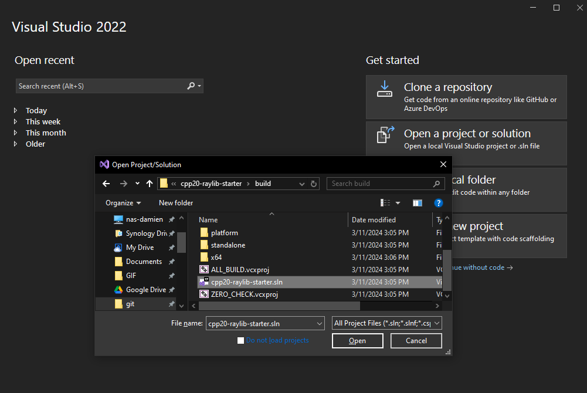
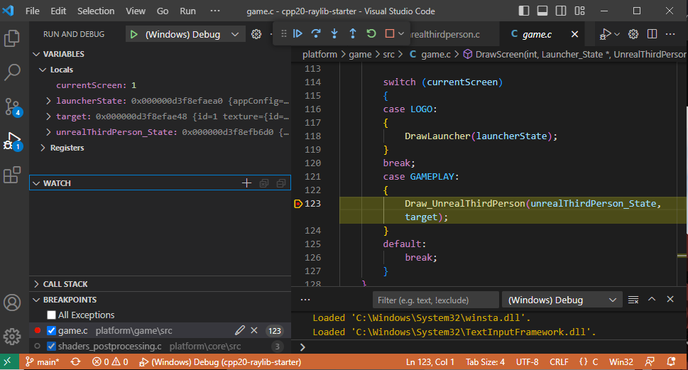

# 3D Game Starter - C 2017, RayLib 5.0, OpenGL 3

[](https://opensource.org/licenses/MIT)
[](https://twitter.com/Damien_Fremont)
[](https://www.buymeacoffee.com/damienfremont)

:warning: **WORK IN PROGRESS !!!**

2024's small template to start your raylib game. Featuring 3D, C 2017, Raylib 5.0, OpenGL 3 and a modular architecture.


## Content

  - [Dependencies](#dependencies)
  - [Screenshots](#screenshots)
  - [Features](#features)
  - [Install](#install)
  - [Usage](#usage)
  - [Assets](#assets)
  - [Resources](#resources)

---------------------------------------

## Dependencies

- C++ 2020 / C 2017
- [RayLib 5.0](https://www.raylib.com/)
- OpenGL 3.30

## Screenshots









## Features

- Targets:
  - [x] Win64 (Windows)
  - [ ] Linux
  - [ ] SteamDeck (Windows/Linux)
  - [ ] HTML5 (WebAssembly)
  - [ ] Discord (WebAssembly)
- Graphics
  - [x] Render: PostProcessing Bloom, AA MSAA, Texture Filtering
  - [x] Camera: ThirdPerson, Follow
  - [x] Lighting: World Lighting, Player Lighting, Player Shadows 
  - [ ] Meshes: Meshes, Textures, Shaders, Materials, 
      [ ] Texture tiling
  - [x] Sky: Color, Cubemap, Fog
- World
  - [ ] Physics
      [ ] hitbox
      [ ] gravity
  - [x] Simulation: Tick Systems
- Scripting
  - [x] Console
- Animation
  - [x] Character
- Input
  - [x] UI: lauch screen, settings menu
  - [x] Input: Keyboard, Arrows, Gamepad
  - [ ] Control: [x] Tank control, [ ] Third Person
- Other
  - [x] launching screen

Repository layout:
```
├── assets
│   └── images
│   └── ...
├── docs
├── infra
├── lib
│   ├── raylib-5.0_win64_msvc16
│   ├── winmm-10-win64
├── platform
│   ├── engine
│   └── game
├── standalone
│   ├── desktop_win64
└── tools
    └── blender
    └── ci
```

## Install

### Windows

CMake:
- Download the `v3.28.3` release of `CMake` at http://www.cmake.org/download/.
- Pick Windows (`Windows x64 Installer`).
- Run the installer
- When asked for, select `Add CMake to the system PATH for all users`.
- Run software installation...

Visual Studio:
- Download the `Community` version of `Visual Studio 2022` release of Visual Studio at https://visualstudio.microsoft.com/downloads/
- Run the installer...
- Run software `Visual Studio Installer`
- When asked for, click on `modify` under `Visual Studio 2002`
- Select `Desktop development with C++` (contains MVC package)
- Click on `modify`

PowerShell:
```powershell
cmake -S "." -B "build" -G "Visual Studio 17 2022"
```

## Usage

### CLI (pure CMake)

- Pros: basic, no Editor, CI friendly.
- Cons: manual actions intensive.

```powershell
.\tools\ci\install.bat

.\tools\ci\dev.bat
# OR
.\tools\ci\release.bat
```

### VisualStudio 2022 (IDE)

- Pros: better integration, 1 step compile+debug.
- Cons: very laggy UI, bad search tools.

```powershell
.\tools\ci\install.bat
```




### VSCode

- Pros: better code editor, lightweight. 
- Cons: 2 steps compile+debug

```powershell
.\tools\ci\install.bat

.\tools\ci\watch.bat
```

Run (press Ctrl+F5, or Menu > "Run" > "Run without Debugging")

Debug (press F5, or Menu > "Run" > "Start Debugging")



## Assets

### Pipeline

Installation:

1. Download [io_scene_m3d.py](./tools/blender/io_scene_m3d.py)
1. Start Blender
1. Go to menu, "Edit" > "Preferences..." > "Add-ons" tab > "Install..." button
1. Browse and double click on the downloaded file
1. On the "Add-ons" tab, search for "m3d"
1. Click on "Enable Add-on."
1. Now in the menu, "File" > "Export" > "Model 3D (.m3d)" (and eventually "File" > "Import" > "Model 3D (.m3d)") should appear

Get 3D Models:

1. Start WebBrowser...
1. https://www.mixamo.com
1. Click Characters 
1. search "X bot"
1. Click Download
1. Check Format: fbx, pose: t-pose
1. Click Download
1. Start Blender...
1. Go to menu, File > New > General ...Delete Cube
1. Go to menu, File > Import > FBX > "X bot.fbx"
1. Click on the "Texture Paint" tab > click "new" > type "X_bot_diffuse"
1. On right side panel > click "material" > "base color" > "image texture" > select "X_bot_diffuse"
1. Go to menu, File > Export > M3D > scale: 2.0 > "X_bot.m3d" > Export

Get 3D Animations:

1. Start WebBrowser...
1. https://www.mixamo.com
1. Click Animations 
1. search "Slow Run"
1. check "In Place" box
1. Click Download
1. Check Format: fbx, Skin: with skin
1. Click Download
1. Start Blender...
1. Go to menu, File > New > General ...Delete Cube
1. Go to menu, File > Import > FBX > "Slow Run.fbx"
1. Click on the "Animation" tab > click "editor type icon" > "non linear animation" (new channel editor)
1. click "push down action" (new channel)
1. Go to menu, File > Export > M3D > scale: 2.0 > "Slow Run.m3d" > Export

## FAQ

### Why Models are sometime unlit ?

Cause: Blender export changes materials indexes (start with 0 or 1) and lighting shader needs to be applied to real material.
- `*.obj`, `*.iqm` formats: use `material[0]`
- `*.m3d`, `*.glb` formats: use `material[1]`


### What about performance ?

Condition: GPU: RTX-2060, CPU: i5-9600K, RAM: 32 GB
- Raylib (GL3) "High": `~2500 FPS` (AA `4x`, Postpro `Bloom`)
- Raylib (GL3) "Low": `~3000 FPS`
- Unreal (DX12) "Low": `~150 FPS` (Settings=`Low`)


## Resources

- C
  - [ModernCppStarter](https://github.com/TheLartians/ModernCppStarter/tree/master)
- CMake
  - [CMake with include and source paths - basic setup](https://stackoverflow.com/questions/8304190/cmake-with-include-and-source-paths-basic-setup)
  - [CMake add_library](http://www.cunningplanning.com/post/cmake-add-library/)
  - [Specify the default startup project in a Visual Studio solution.](https://cmake.org/cmake/help/latest/prop_dir/VS_STARTUP_PROJECT.html)
  - [How To Automatically Build CMake](https://medium.com/@damngoodtech/how-to-automatically-build-compile-and-test-cmake-c-unit-tests-on-file-save-9e7fe259e7ae)
- Monorepo
  - [How to structure a monorepo](https://lucapette.me/writing/how-to-structure-a-monorepo/?utm_source=atom_feed)
  - [A monorepo template that actually works](https://levelup.gitconnected.com/a-monorepo-template-that-actually-works-3efd87770fa5)
- VS Code
  - [Configure C/C++ debugging](https://code.visualstudio.com/docs/cpp/launch-json-reference)
- Raylib
  - [raylib vs SDL - A libraries comparison](https://gist.github.com/raysan5/17392498d40e2cb281f5d09c0a4bf798)
  - [raylib-game-template](https://github.com/raysan5/raylib-game-template)
  - [Examples GitHub](https://github.com/raysan5/raylib/blob/master/examples/)
  - [Examples Demos (HTML5)](https://www.raylib.com/examples.html)
    - [shaders_postprocessing](https://www.raylib.com/examples/shaders/loader.html?name=shaders_postprocessing) 
    - [shaders_texture_tiling](https://www.raylib.com/examples/shaders/loader.html?name=shaders_texture_tiling)
    - [shaders_basic_lighting](https://www.raylib.com/examples/shaders/loader.html?name=shaders_basic_lighting)
    - [shaders_fog](https://www.raylib.com/examples/shaders/loader.html?name=shaders_fog)
    - [text_draw_3d](https://www.raylib.com/examples/text/loader.html?name=text_draw_3d)
    - [textures_image_processing](https://www.raylib.com/examples/textures/loader.html?name=textures_image_processing)
  - [how to properly setup raylib app to talk to glsl shaders](https://sepi.prose.sh/2022-09-11-how-to-properly-use-shaders-in-raylib)
  - WASM
    - [Working for Web (HTML5)](https://github.com/raysan5/raylib/wiki/Working-for-Web-(HTML5))
    - [Creating Discord Activities with raylib](https://github.com/raysan5/raylib/wiki/Creating-Discord-Activities-with-raylib)
  - Shadow
    - [c99-raylib-shadowmap](https://github.com/WEREMSOFT/c99-raylib-shadowmap/tree/master)
- Quality
  - [cppcheck](https://cppcheck.sourceforge.io/)
- Model3D Format
  - [Welcome to Model 3D!](https://bztsrc.gitlab.io/model3d/)
  - [Model 3D Blender Integration](https://gitlab.com/bztsrc/model3d/tree/master/blender/)
  - [io_scene_m3d.py](https://gitlab.com/bztsrc/model3d/-/blob/master/blender/io_scene_m3d.py)
  - [IQM Export](https://www.youtube.com/watch?v=x6Fw62lX5Dg)

## References

There are several games made with raylib to highlight:
- Hare136: https://play.google.com/store/apps/details?id=games.haremonic.slider
- SideStep Legends: https://store.steampowered.com/app/2077590/Sidestep_Legends/
- Pure Logic: https://store.steampowered.com/app/1861500/Pure_Logic/

There are also many small games (and tools) made with raylib on itchio: https://itch.io/c/380928/made-with-raylib
